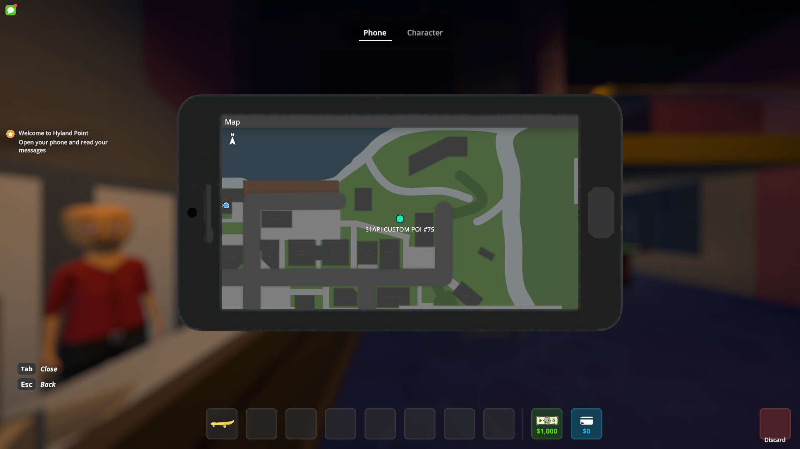

# Standalone Map POIs

S1API can create and manage standalone markers on the phone's map without creating a `Quest` or `QuestEntry`.



Use a mod-namespaced ID so your markers cannot collide with another mod:

```csharp
using S1API.Map;
using UnityEngine;

MapPOI stashMarker = new MapPOIBuilder("my-mod:supplier-stash")
    .WithLabel("Supplier Stash")
    .WithPosition(new Vector3(42f, 0f, -18f))
    .WithIcon(stashIcon)
    .WithTextVisibility(MapPOITextVisibility.OnHover)
    .Build();
```

`Build()` registers the ID immediately and returns a handle. Native creation is deferred until the local player's phone-map POI template is available, so this is safe to call before `MapApp` has initialized. Configuration changes made through the handle while initialization is pending are applied when the native marker is created.

## Moving markers

Bind the marker to a `Transform` to follow a moving target without writing an update loop:

```csharp
MapPOI vehicleMarker = new MapPOIBuilder("my-mod:delivery-vehicle")
    .WithLabel("Delivery Vehicle")
    .WithTarget(vehicle.transform)
    .WithRotation()
    .Build();
```

`SetTarget(...)` changes the followed target later. `SetPosition(...)` returns the marker to a fixed world position.

## Updating and focusing

```csharp
stashMarker
    .SetLabel("Discovered Stash")
    .SetIcon(discoveredIcon)
    .SetVisible(true)
    .SetTextVisibility(MapPOITextVisibility.Always);

if (stashMarker.IsUIReady)
{
    stashMarker.Focus();
}
```

`IsReady` means the native POI exists. `IsUIReady` means the phone map has also created its UI. `Focus()` returns `false` when that UI is not ready yet.

Pass `null` to `SetIcon(...)` to restore the native marker appearance.

## Lookup and cleanup

```csharp
if (MapPOIManager.TryGet("my-mod:supplier-stash", out MapPOI? marker))
{
    marker.SetVisible(false);
}

MapPOIManager.Remove("my-mod:supplier-stash");
```

`Remove()` and `MapPOIManager.Remove(...)` are safe to call repeatedly. S1API invalidates standalone marker handles when the `Main` or `Tutorial` scene unloads, so mods should recreate markers for each gameplay session. Marker state is not saved automatically.

Standalone map POIs do not create compass or HUD waypoints. Use the quest waypoint APIs when a marker needs quest tracking and compass behavior.

## Runtime compatibility

The API is supported by the MonoMelon and Il2CppMelon builds. S1API owns the protected native prefab access, delayed initialization, and runtime namespace differences; consumers do not need reflection or backend-specific aliases.
